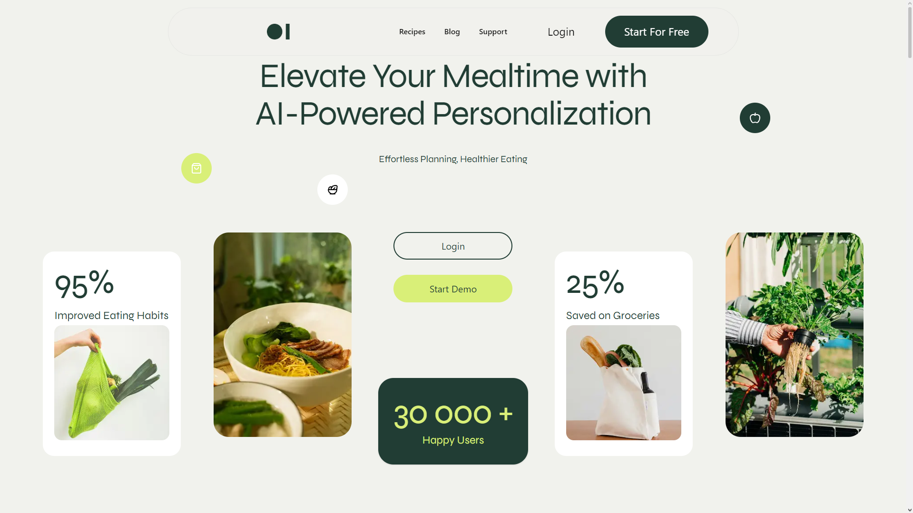
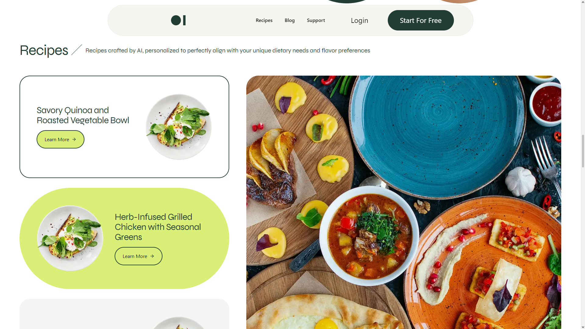

# Cook AI

Cook AI is a modern AI-powered web application built with Next.js, Tailwind CSS, shadcn/ui, and Framer Motion. The application is designed to help users generate recipes, discover meal ideas, and simplify meal planning through an intuitive and responsive user interface.

**Note:** This repository currently contains the front-end implementation only. AI services and backend functionality are planned for future development.

---

## Features

- AI-inspired recipe generation interface
- Meal planning experience
- Modern and responsive design
- Smooth page and component animations
- Clean and accessible user interface

---

## Tech Stack

- Next.js
- React
- Tailwind CSS
- shadcn/ui
- Framer Motion

---

## Getting Started

### Clone the repository

```bash
git clone https://github.com/emir-e1/cook-ai.git
```

### Install dependencies

```bash
npm install
```

### Start the development server

```bash
npm run dev
```

The application will be available at:

```
http://localhost:3000
```

---

## Project Structure

```
app/
components/
public/
styles/
```

---

## Screenshots

### Home Page



### Recipe Generator



### Meal Planner


---

## License

This project is licensed under the MIT License.
